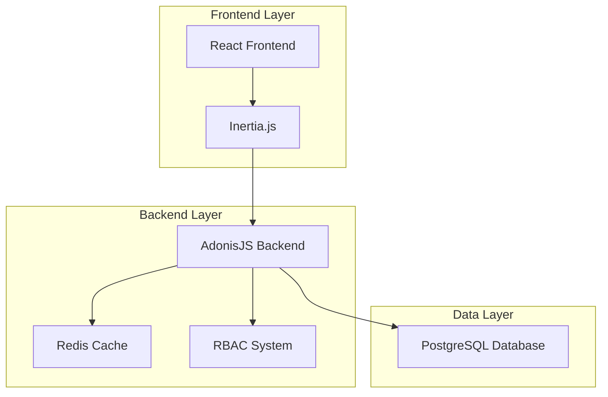
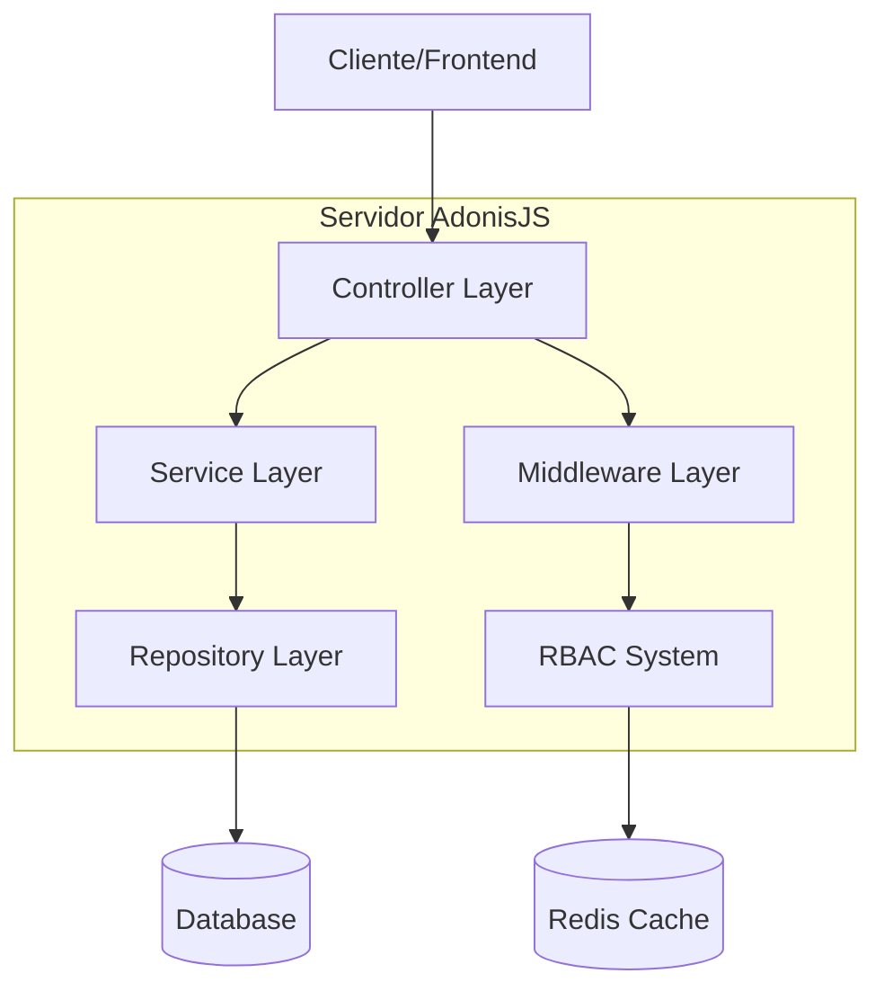
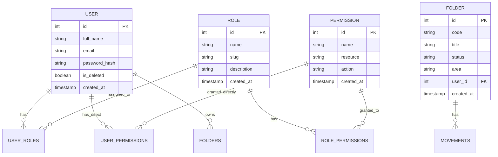

# Arquitetura Técnica - Fluxo de Navegação por Papéis

## 1. Arquitetura do Sistema



## 2. Descrição das Tecnologias

- **Frontend**: React\@19 + Inertia.js + TypeScript + TailwindCSS

- **Backend**: AdonisJS\@6 + Node.js\@22.19.0

- **Banco de Dados**: PostgreSQL (via Supabase/local)

- **Cache**: Redis

- **Autenticação**: JWT com sistema RBAC existente

## 3. Definições de Rotas

| Rota                              | Propósito                                       |
| --------------------------------- | ----------------------------------------------- |
| `/login`                          | Página de login unificada                       |
| `/dashboard`                      | Dashboard padrão (redireciona baseado no papel) |
| `/dashboard/collaborator`         | Dashboard específico do colaborador             |
| `/dashboard/manager`              | Dashboard específico do gestor                  |
| `/dashboard/client`               | Dashboard específico do cliente                 |
| `/dashboard/folders/consultation` | Consulta processual (existente)                 |
| `/dashboard/folders/:id`          | Visualização detalhada do processo (existente)  |

## 4. APIs e Serviços

### 4.1 APIs de Autenticação

**Login com redirecionamento baseado em papel**

```
POST /login
```

Request:

| Parâmetro | Tipo   | Obrigatório | Descrição        |
| --------- | ------ | ----------- | ---------------- |
| email     | string | true        | Email do usuário |
| password  | string | true        | Senha do usuário |

Response:

| Parâmetro    | Tipo    | Descrição                                |
| ------------ | ------- | ---------------------------------------- |
| success      | boolean | Status da autenticação                   |
| redirect_url | string  | URL de redirecionamento baseada no papel |
| user         | object  | Dados do usuário autenticado             |
| roles        | array   | Papéis do usuário                        |

Exemplo:

```json
{
  "success": true,
  "redirect_url": "/dashboard/collaborator",
  "user": {
    "id": 1,
    "name": "João Silva",
    "email": "joao@benicio.com"
  },
  "roles": ["user", "editor"]
}
```

### 4.2 APIs do Dashboard

**Dados do Dashboard do Colaborador**

```
GET /api/dashboard/collaborator
```

Response:

| Parâmetro         | Tipo  | Descrição                    |
| ----------------- | ----- | ---------------------------- |
| active_folders    | array | Pastas ativas do colaborador |
| upcoming_hearings | array | Próximas audiências          |
| pending_tasks     | array | Tarefas pendentes            |
| recent_movements  | array | Movimentações recentes       |

**Verificação de Permissões**

```
GET /api/me/permissions
```

Response:

| Parâmetro   | Tipo  | Descrição                      |
| ----------- | ----- | ------------------------------ |
| permissions | array | Lista de permissões do usuário |
| roles       | array | Papéis do usuário              |

## 5. Arquitetura do Servidor



### 5.1 Camadas da Aplicação

**Controller Layer**:

- `AuthController` - Gerencia login e redirecionamento

- `DashboardController` - Endpoints específicos por papel

- `FoldersController` - Consulta e visualização de processos

**Service Layer**:

- `RoleBasedRedirectService` - Lógica de redirecionamento

- `CollaboratorDashboardService` - Dados específicos do colaborador

- `PermissionCheckService` - Verificação de permissões

**Middleware Layer**:

- `auth_middleware.ts` - Autenticação (existente)

- `acl_middleware.ts` - Controle de acesso por papel (existente)

- `permission_middleware.ts` - Verificação de permissões (existente)

## 6. Modelo de Dados

### 6.1 Diagrama de Entidades



### 6.2 Estrutura de Dados Existente

**Tabela de Usuários (users)**

```sql
-- Estrutura existente mantida
CREATE TABLE users (
    id SERIAL PRIMARY KEY,
    full_name VARCHAR(255) NOT NULL,
    email VARCHAR(255) UNIQUE NOT NULL,
    username VARCHAR(100),
    password VARCHAR(255) NOT NULL,
    is_deleted BOOLEAN DEFAULT FALSE,
    created_at TIMESTAMP DEFAULT NOW(),
    updated_at TIMESTAMP DEFAULT NOW()
);
```

**Tabela de Papéis (roles)**

```sql
-- Estrutura existente mantida
CREATE TABLE roles (
    id SERIAL PRIMARY KEY,
    name VARCHAR(100) NOT NULL,
    slug VARCHAR(50) UNIQUE NOT NULL,
    description TEXT,
    created_at TIMESTAMP DEFAULT NOW(),
    updated_at TIMESTAMP DEFAULT NOW()
);

-- Dados padrão existentes
INSERT INTO roles (name, slug, description) VALUES
('Root', 'root', 'Acesso total ao sistema'),
('Administrador', 'admin', 'Acesso administrativo'),
('Usuário', 'user', 'Acesso básico'),
('Editor', 'editor', 'Acesso de edição'),
('Convidado', 'guest', 'Acesso limitado');
```

**Configuração de Cache Redis**

```sql
-- Chaves de cache para otimização
-- user:permissions:{user_id} - Permissões do usuário
-- user:roles:{user_id} - Papéis do usuário
-- dashboard:collaborator:{user_id} - Dados do dashboard
```

## 7. Implementação Frontend

### 7.1 Estrutura de Componentes

```
inertia/
├── pages/
│   ├── auth/
│   │   └── login.tsx (existente)
│   ├── dashboard/
│   │   ├── index.tsx (adaptar)
│   │   ├── collaborator.tsx (novo)
│   │   ├── manager.tsx (novo)
│   │   └── client.tsx (novo)
│   └── folders/
│       ├── consultation.tsx (existente)
│       └── show.tsx (existente)
├── features/
│   ├── dashboard/
│   │   ├── components/
│   │   │   ├── CollaboratorDashboard.tsx (novo)
│   │   │   ├── ManagerDashboard.tsx (novo)
│   │   │   └── ClientDashboard.tsx (novo)
│   └── auth/
│       └── hooks/
│           └── useRoleRedirect.ts (novo)
```

### 7.2 Hooks Personalizados

**Hook para Redirecionamento Baseado em Papel**

```typescript
// useRoleRedirect.ts
export function useRoleRedirect(user: User) {
  const getRedirectUrl = () => {
    if (user.roles.includes('root') || user.roles.includes('admin')) {
      return '/dashboard/manager'
    }
    if (user.roles.includes('editor')) {
      return '/dashboard/collaborator'
    }
    if (user.roles.includes('user')) {
      return '/dashboard/client'
    }
    return '/dashboard'
  }

  return { redirectUrl: getRedirectUrl() }
}
```

## 8. Segurança e Controle de Acesso

### 8.1 Middleware de Segurança

- **Autenticação**: Verificação de JWT válido

- **Autorização**: Verificação de papéis via `acl_middleware`

- **Permissões**: Verificação granular via `permission_middleware`

- **Rate Limiting**: Proteção contra ataques (existente)

### 8.2 Controle de Acesso por Rota

```typescript
// Exemplo de proteção de rota
router
  .get('/dashboard/collaborator', [DashboardController, 'collaborator'])
  .use([middleware.auth(), middleware.acl({ role_slugs: ['user', 'editor'] })])
```

## 9. Performance e Otimização

### 9.1 Estratégias de Cache

- **Redis**: Cache de permissões e papéis do usuário

- **Frontend**: Cache de dados do dashboard via React Query

- **Database**: Índices otimizados nas tabelas de relacionamento

### 9.2 Otimizações de Query

```sql
-- Índices recomendados
CREATE INDEX idx_user_roles_user_id ON user_roles(user_id);
CREATE INDEX idx_folders_user_id_status ON folders(user_id, status);
CREATE INDEX idx_movements_folder_id_date ON movements(folder_id, movement_date DESC);
```
