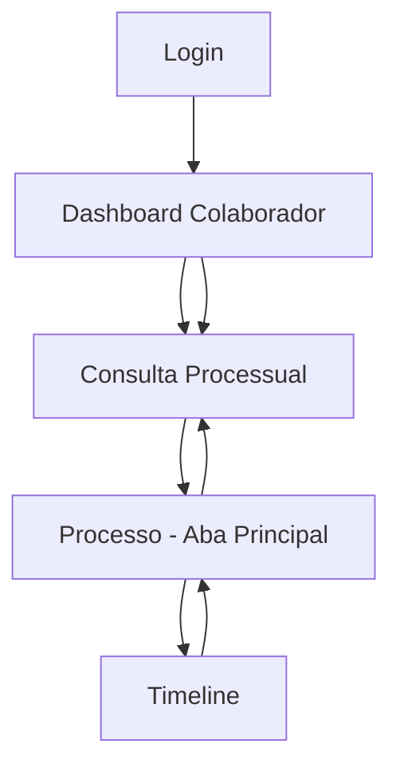

# Fluxo de Navegação por Papéis de Usuário - Sistema YOL Benício

## 1. Visão Geral do Produto

Implementação de um fluxo de navegação unificado para diferentes tipos de usuários (Gestor, Cliente, Colaborador) no sistema jurídico YOL Benício, aproveitando a infraestrutura RBAC existente e adaptando as telas atuais para criar experiências personalizadas baseadas no papel do usuário.

O sistema já possui login funcional, dashboard base, consulta de pastas, visualização de processos e timeline de movimentações. O objetivo é criar visões específicas e um fluxo otimizado para colaboradores.

## 2. Funcionalidades Principais

### 2.1 Papéis de Usuário

| Papel       | Método de Acesso           | Permissões Principais                                   |
| ----------- | -------------------------- | ------------------------------------------------------- |
| Gestor      | Login com role ADMIN/ROOT  | Acesso completo, gerenciamento de equipe, relatórios    |
| Cliente     | Login com role USER        | Visualização de seus processos, consultas limitadas     |
| Colaborador | Login com role USER/EDITOR | Operações do dia-a-dia, consultas processuais, timeline |

### 2.2 Módulos de Funcionalidade

O fluxo de navegação consiste nas seguintes páginas principais:

1. **Login**: Autenticação unificada com redirecionamento baseado no papel
2. **Dashboard do Colaborador**: Visão otimizada para operações diárias
3. **Consulta Processual**: Interface de busca e listagem de processos
4. **Processo - Aba Principal**: Detalhes principais do processo selecionado
5. **Timeline**: Histórico de movimentações processuais

### 2.3 Detalhes das Páginas

| Página                | Módulo          | Descrição da Funcionalidade                                                                 |
| --------------------- | --------------- | ------------------------------------------------------------------------------------------- |
| Login                 | Autenticação    | Validação de credenciais, redirecionamento baseado em papel, recuperação de senha           |
| Dashboard Colaborador | Visão Geral     | Cards de pastas ativas, audiências próximas, tarefas pendentes, acesso rápido à consulta    |
| Consulta Processual   | Busca e Filtros | Filtros por cliente, data, área, status. Listagem paginada, exportação, seleção múltipla    |
| Processo Principal    | Detalhes        | Informações do processo, dados do cliente, advogado responsável, valores, datas importantes |
| Timeline              | Movimentações   | Histórico cronológico, adição de movimentações, filtros por tipo, responsável               |

## 3. Fluxo Principal de Navegação

### Fluxo do Colaborador:

1. **Login** → Validação de credenciais
2. **Dashboard Colaborador** → Visão geral personalizada com:
   - Pastas ativas do colaborador

   - Próximas audiências

   - Tarefas pendentes

   - Acesso rápido à consulta processual

3. **Consulta Processual** → Busca e filtros específicos
4. **Seleção de Processo** → Clique em processo da lista
5. **Processo - Aba Principal** → Detalhes principais
6. **Timeline** → Navegação via aba "Andamento"



## 4. Design da Interface

### 4.1 Estilo de Design

- **Cores Primárias**: #373737 (cinza escuro), #00B8D9 (azul), #F1F1F2 (cinza claro)

- **Cores Secundárias**: Laranja (#FF6B35) para destaques, branco para cards

- **Estilo de Botões**: Bordas arredondadas, sombras suaves

- **Fonte**: Work Sans, tamanhos 14px-40px

- **Layout**: Card-based, navegação lateral, header fixo

- **Ícones**: Outline style, consistentes com o tema jurídico

### 4.2 Visão Geral das Páginas

| Página                | Módulo            | Elementos de UI                                                                   |
| --------------------- | ----------------- | --------------------------------------------------------------------------------- |
| Login                 | Formulário        | Card branco centralizado, fundo cinza com elementos decorativos laranja, logo YOL |
| Dashboard Colaborador | Cards Principais  | Grid responsivo, cards brancos com sombras, cores de status, gráficos simples     |
| Consulta Processual   | Filtros e Tabela  | Tabs superiores, filtros laterais, tabela responsiva, paginação                   |
| Processo Principal    | Detalhes          | Layout em duas colunas, campos organizados em grupos, labels claras               |
| Timeline              | Lista Cronológica | Lista vertical com conectores, ícones de status, timestamps, botão de adição      |

### 4.3 Responsividade

Design mobile-first com adaptações para desktop. Navegação lateral colapsável em mobile, cards empilhados, tabelas com scroll horizontal quando necessário.

## 5. Implementação Técnica

### 5.1 Componentes Existentes a Adaptar

- **Login**: `/inertia/pages/auth/login.tsx` - Já implementado

- **Dashboard**: `/inertia/pages/dashboard/index.tsx` - Adaptar para colaborador

- **Consulta**: `/inertia/pages/folders/consultation.tsx` - Já implementado

- **Processo**: `/inertia/pages/folders/show.tsx` - Aba "processo" existente

- **Timeline**: `/inertia/features/folders/components/ProcessTimeline.tsx` - Já implementado

### 5.2 Adaptações Necessárias

1. **Dashboard do Colaborador**:
   - Criar componente `CollaboratorDashboard`

   - Filtrar dados baseado no papel do usuário

   - Cards específicos para workflow do colaborador

2. **Redirecionamento Pós-Login**:
   - Modificar `AuthController.login()` para redirecionar baseado no papel

   - Gestor → Dashboard completo

   - Cliente → Dashboard limitado

   - Colaborador → Dashboard específico

3. **Controle de Acesso**:
   - Utilizar middleware existente `acl_middleware.ts`

   - Implementar verificações de papel nas rotas

   - Filtrar dados baseado nas permissões

### 5.3 Rotas Necessárias

```typescript
// Rotas específicas por papel
/dashboard/collaborator - Dashboard do colaborador
/dashboard/manager - Dashboard do gestor
/dashboard/client - Dashboard do cliente

// Rotas existentes mantidas
/dashboard/folders/consultation - Consulta processual
/dashboard/folders/:id - Visualização do processo
```

## 6. Critérios de Aceitação

- [ ] Login redireciona corretamente baseado no papel do usuário

- [ ] Dashboard do colaborador exibe informações relevantes

- [ ] Consulta processual funciona com filtros apropriados

- [ ] Navegação entre processo e timeline é fluida

- [ ] Interface responsiva em mobile e desktop

- [ ] Controle de acesso baseado em RBAC funcional

- [ ] Performance adequada com carregamento < 2s

- [ ] Testes unitários e funcionais implementados
