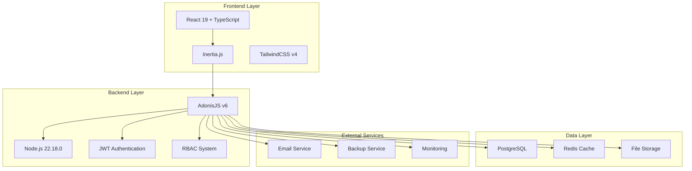

# Sistema YOL Benício - Documentação Completa

## 1. Visão Geral do Produto

O **Sistema YOL Benício** é uma plataforma completa de gestão jurídica desenvolvida para escritórios de advocacia, oferecendo controle total sobre processos, clientes, documentos e equipe. O sistema combina uma arquitetura moderna e robusta com uma interface intuitiva, proporcionando eficiência operacional e segurança de dados.

### 1.1 Objetivos Principais

- **Centralização**: Unificar todas as informações jurídicas em uma única plataforma
- **Eficiência**: Automatizar processos repetitivos e otimizar fluxos de trabalho
- **Segurança**: Garantir proteção de dados sensíveis com controle de acesso granular
- **Colaboração**: Facilitar o trabalho em equipe com diferentes níveis de permissão
- **Compliance**: Atender às exigências regulamentares do setor jurídico

### 1.2 Público-Alvo

- **Escritórios de Advocacia**: Pequenos, médios e grandes escritórios
- **Advogados Autônomos**: Profissionais independentes
- **Departamentos Jurídicos**: Empresas com equipes jurídicas internas
- **Assessorias Jurídicas**: Consultorias especializadas

## 2. Arquitetura do Sistema

### 2.1 Visão Geral da Arquitetura

### 2.2 Stack Tecnológico

