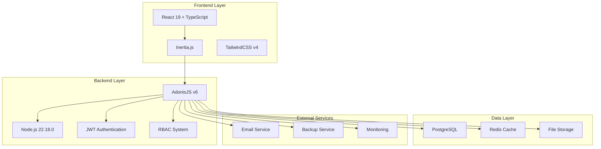
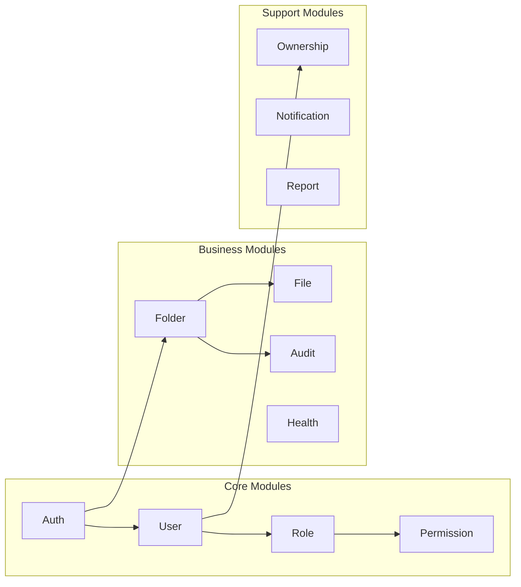
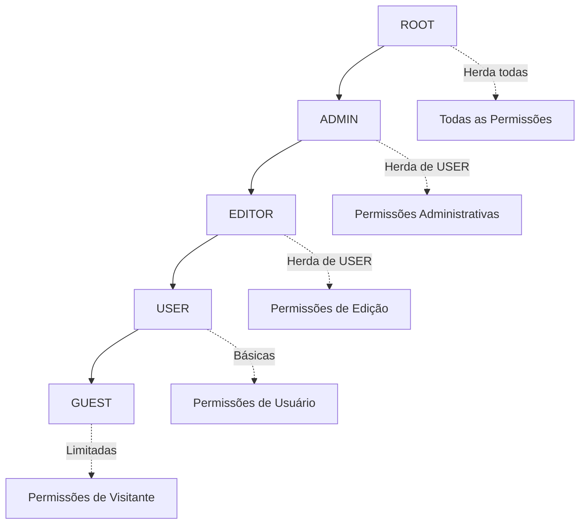
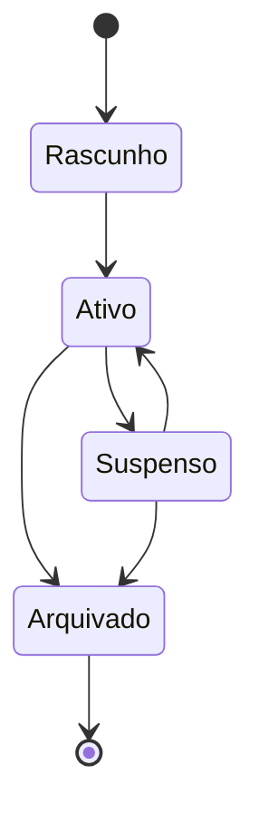
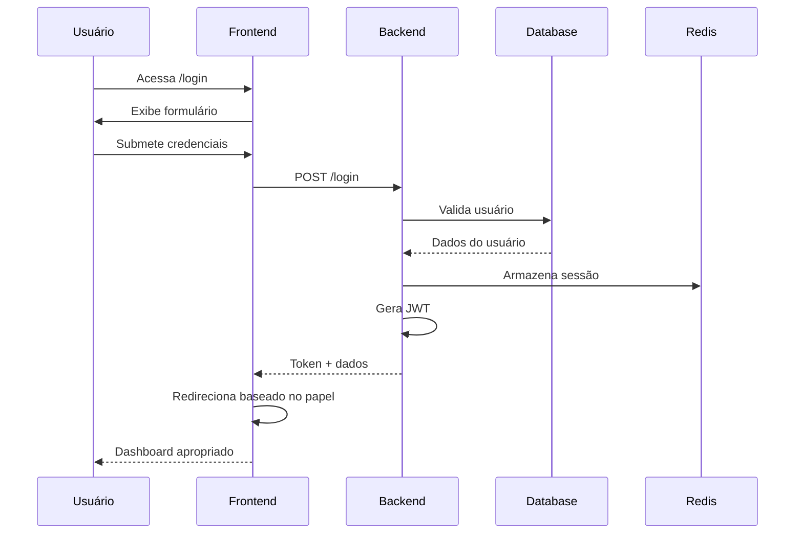
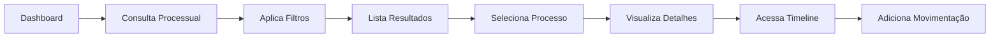

# Sistema YOL Benício - Documentação Completa

## 1. Visão Geral do Produto

O **Sistema YOL Benício** é uma plataforma completa de gestão jurídica desenvolvida para escritórios de advocacia, oferecendo controle total sobre processos, clientes, documentos e equipe. O sistema combina uma arquitetura moderna e robusta com uma interface intuitiva, proporcionando eficiência operacional e segurança de dados.

### 1.1 Objetivos Principais

- **Centralização**: Unificar todas as informações jurídicas em uma única plataforma
- **Eficiência**: Automatizar processos repetitivos e otimizar fluxos de trabalho
- **Segurança**: Garantir proteção de dados sensíveis com controle de acesso granular
- **Colaboração**: Facilitar o trabalho em equipe com diferentes níveis de permissão
- **Compliance**: Atender às exigências regulamentares do setor jurídico

### 1.2 Público-Alvo

- **Escritórios de Advocacia**: Pequenos, médios e grandes escritórios
- **Advogados Autônomos**: Profissionais independentes
- **Departamentos Jurídicos**: Empresas com equipes jurídicas internas
- **Assessorias Jurídicas**: Consultorias especializadas

## 2. Arquitetura do Sistema

### 2.1 Visão Geral da Arquitetura



### 2.2 Stack Tecnológico

| Camada | Tecnologia | Versão | Propósito |
|--------|------------|--------|-----------|
| **Frontend** | React | 19.x | Interface do usuário |
| **Frontend** | Inertia.js | 2.x | SPA sem API separada |
| **Frontend** | TypeScript | 5.x | Tipagem estática |
| **Frontend** | TailwindCSS | 4.x | Estilização |
| **Backend** | AdonisJS | 6.x | Framework web |
| **Runtime** | Node.js | 22.18.0+ | Ambiente de execução |
| **Database** | PostgreSQL | 15+ | Banco de dados principal |
| **Cache** | Redis | 7+ | Cache e sessões |
| **Auth** | JWT | - | Autenticação |
| **Tests** | Japa | 3.x | Framework de testes |
| **Mock** | MSW | 2.x | Mock Service Worker |

### 2.3 Arquitetura Modular



## 3. Módulos e Funcionalidades

### 3.1 Módulo de Autenticação (Auth)

**Responsabilidades:**
- Login/Logout de usuários
- Gerenciamento de sessões
- Recuperação de senha
- Autenticação JWT
- Rate limiting

**Componentes Principais:**
- `AuthController`: Controle de autenticação
- `AuthMiddleware`: Middleware de autenticação
- `JwtGuard`: Guarda JWT personalizado
- `LoginValidator`: Validação de credenciais

### 3.2 Módulo de Usuários (User)

**Responsabilidades:**
- CRUD de usuários
- Perfis de usuário
- Configurações pessoais
- Histórico de atividades

**Funcionalidades:**
- Cadastro e edição de usuários
- Upload de foto de perfil
- Configurações de notificação
- Soft delete para auditoria

### 3.3 Sistema RBAC (Role-Based Access Control)

**Hierarquia de Papéis:**



**Permissões por Módulo:**

| Módulo | CREATE | READ | UPDATE | DELETE | ADMIN |
|--------|--------|------|--------|-----------|-------|
| **Users** | ADMIN+ | USER+ | OWNER/ADMIN | ADMIN+ | ROOT |
| **Folders** | USER+ | OWNER+ | OWNER/EDITOR+ | OWNER/ADMIN+ | ADMIN+ |
| **Files** | USER+ | OWNER+ | OWNER/EDITOR+ | OWNER/ADMIN+ | ADMIN+ |
| **Roles** | ROOT | ADMIN+ | ROOT | ROOT | ROOT |
| **Permissions** | ROOT | ADMIN+ | ROOT | ROOT | ROOT |

### 3.4 Módulo de Pastas/Processos (Folder)

**Funcionalidades Principais:**
- Criação e gestão de processos
- Organização hierárquica
- Controle de status
- Timeline de movimentações
- Anexação de documentos

**Estados do Processo:**



### 3.5 Módulo de Arquivos (File)

**Capacidades:**
- Upload seguro de arquivos
- Controle de versões
- Organização por categorias
- Visualização inline
- Download controlado

**Tipos de Arquivo Suportados:**
- Documentos: PDF, DOC, DOCX, TXT
- Imagens: JPG, PNG, GIF, SVG
- Planilhas: XLS, XLSX, CSV
- Outros: ZIP, RAR

### 3.6 Módulo de Auditoria (Audit)

**Rastreamento:**
- Todas as ações do usuário
- Alterações em dados sensíveis
- Tentativas de acesso
- Operações administrativas

**Informações Capturadas:**
- Usuário responsável
- Timestamp da ação
- IP de origem
- Dados antes/depois
- Tipo de operação

## 4. Fluxos de Usuário

### 4.1 Fluxo de Autenticação



### 4.2 Fluxo de Criação de Processo

```mermaid
flowchart TD
    A[Usuário acessa Dashboard] --> B[Clica em "Novo Processo"]
    B --> C[Preenche formulário]
    C --> D{Dados válidos?}
    D -->|Não| C
    D -->|Sim| E[Salva no banco]
    E --> F[Cria entrada de auditoria]
    F --> G[Notifica equipe]
    G --> H[Redireciona para processo]
```

### 4.3 Fluxo de Consulta Processual



## 5. Interface do Usuário

### 5.1 Design System

**Paleta de Cores:**
- **Primary**: #373737 (Cinza Escuro)
- **Secondary**: #00B8D9 (Azul)
- **Accent**: #FF6B35 (Laranja)
- **Background**: #F1F1F2 (Cinza Claro)
- **Surface**: #FFFFFF (Branco)
- **Success**: #00C851 (Verde)
- **Warning**: #FFB300 (Amarelo)
- **Error**: #FF3547 (Vermelho)

**Tipografia:**
- **Font Family**: Work Sans, Inter, system-ui
- **Sizes**: 12px, 14px, 16px, 18px, 24px, 32px, 40px
- **Weights**: 400 (Regular), 500 (Medium), 600 (Semibold), 700 (Bold)

**Componentes Base:**
- Botões com bordas arredondadas (8px)
- Cards com sombras suaves
- Inputs com foco destacado
- Navegação lateral colapsável
- Modais centralizados

### 5.2 Layouts Responsivos

**Breakpoints:**
- **Mobile**: < 768px
- **Tablet**: 768px - 1024px
- **Desktop**: > 1024px
- **Large**: > 1440px

**Adaptações Mobile:**
- Navegação lateral vira drawer
- Tabelas com scroll horizontal
- Cards empilhados verticalmente
- Botões de ação flutuantes

### 5.3 Dashboards por Papel

**Dashboard do Gestor:**
- Visão geral de todos os processos
- Métricas de performance da equipe
- Relatórios financeiros
- Gestão de usuários e permissões

**Dashboard do Colaborador:**
- Processos atribuídos
- Tarefas pendentes
- Próximas audiências
- Timeline de atividades

**Dashboard do Cliente:**
- Seus processos
- Status e atualizações
- Documentos disponíveis
- Comunicação com advogados

## 6. Segurança e Compliance

### 6.1 Medidas de Segurança

**Autenticação:**
- JWT com refresh tokens
- Rate limiting por IP
- Bloqueio por tentativas
- 2FA (planejado)

**Autorização:**
- RBAC granular
- Ownership validation
- Middleware de permissões
- Audit trail completo

**Dados:**
- Criptografia em trânsito (HTTPS)
- Hashing de senhas (Argon2)
- Soft deletes para auditoria
- Backup automático

### 6.2 Compliance LGPD

- Consentimento explícito
- Direito ao esquecimento
- Portabilidade de dados
- Relatórios de privacidade
- Logs de acesso

## 7. Performance e Escalabilidade

### 7.1 Otimizações

**Backend:**
- Cache Redis para sessões
- Índices otimizados no PostgreSQL
- Lazy loading de relacionamentos
- Paginação em consultas

**Frontend:**
- Code splitting por rotas
- Lazy loading de componentes
- Otimização de imagens
- Service Worker para cache

### 7.2 Monitoramento

**Métricas Coletadas:**
- Tempo de resposta das APIs
- Uso de memória e CPU
- Erros e exceções
- Atividade de usuários

**Alertas Configurados:**
- Alta latência (> 2s)
- Erro rate elevado (> 5%)
- Uso de recursos crítico (> 80%)
- Falhas de autenticação

## 8. Roadmap e Funcionalidades Futuras

### 8.1 Próximas Versões

**v2.0 - Q2 2024:**
- Integração com tribunais
- Assinatura digital
- Relatórios avançados
- API pública

**v2.1 - Q3 2024:**
- Mobile app nativo
- Inteligência artificial
- Workflow automation
- Integração contábil

**v3.0 - Q4 2024:**
- Multi-tenancy
- Marketplace de plugins
- Analytics avançado
- Compliance internacional

### 8.2 Melhorias Contínuas

- Performance optimization
- UX/UI enhancements
- Security updates
- Bug fixes
- Documentation updates

## 9. Conclusão

O Sistema YOL Benício representa uma solução completa e moderna para gestão jurídica, combinando tecnologias de ponta com práticas de desenvolvimento sólidas. A arquitetura modular e escalável permite evolução contínua, enquanto o foco em segurança e usabilidade garante uma experiência confiável para todos os usuários.

A documentação técnica detalhada, testes abrangentes e padrões de código bem definidos asseguram a manutenibilidade e qualidade do sistema a longo prazo.