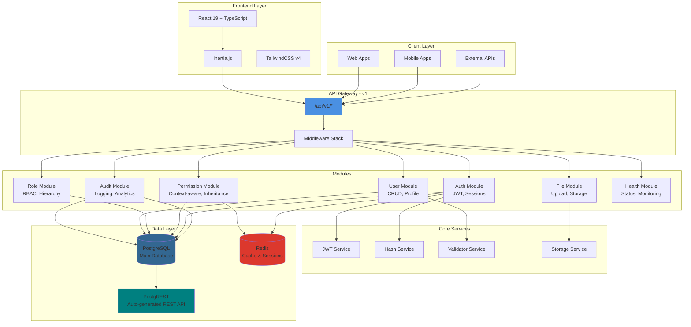
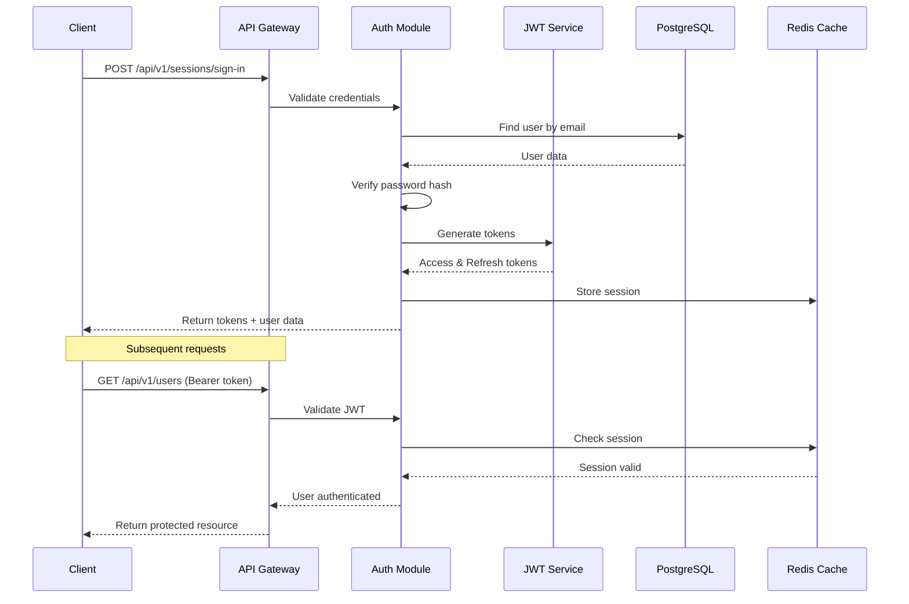
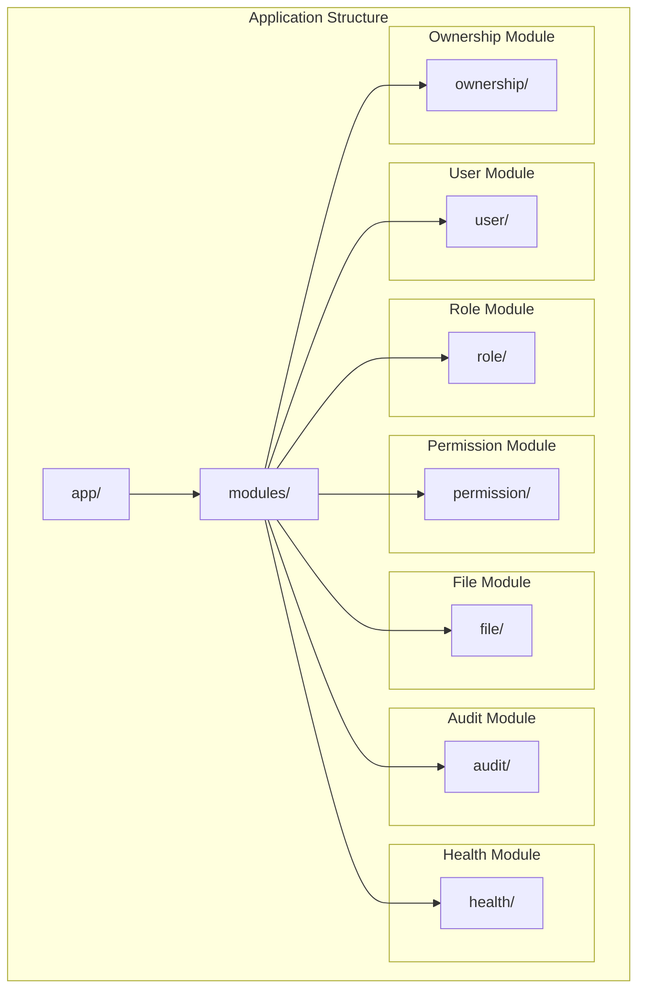
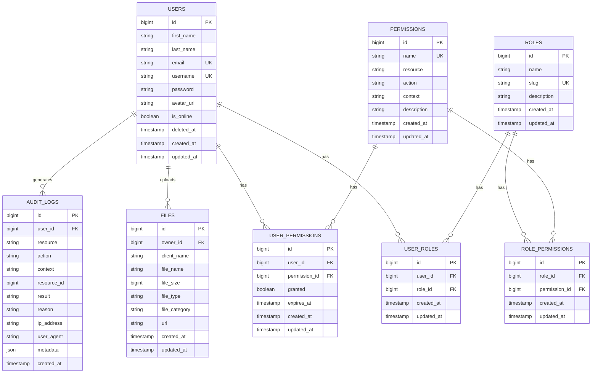
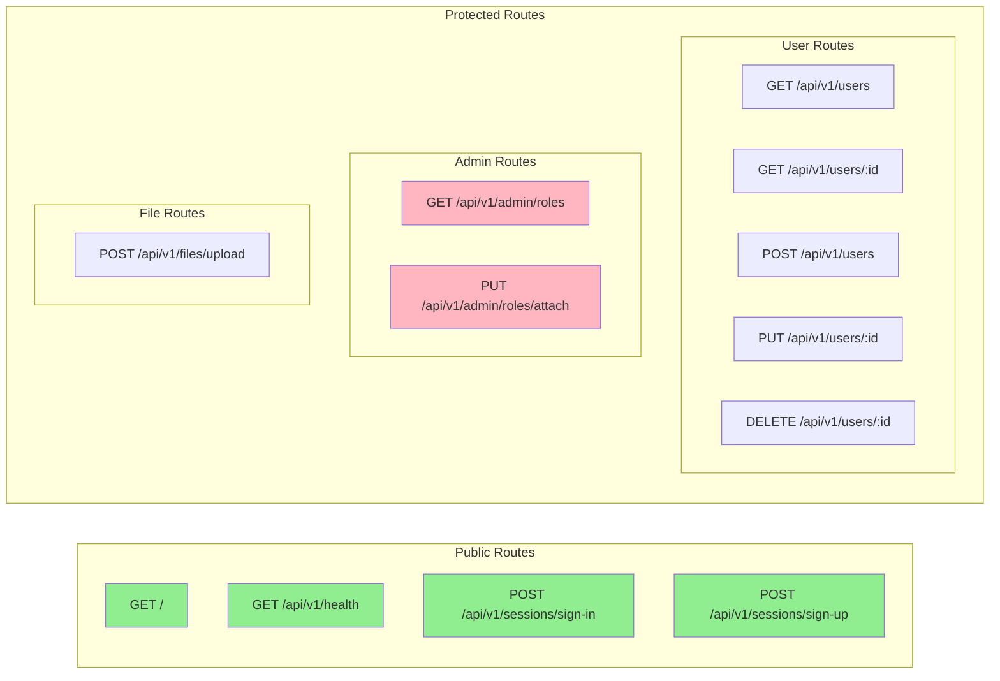
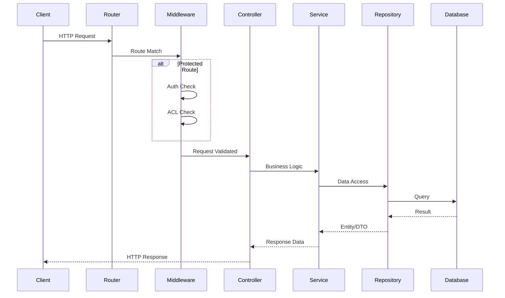
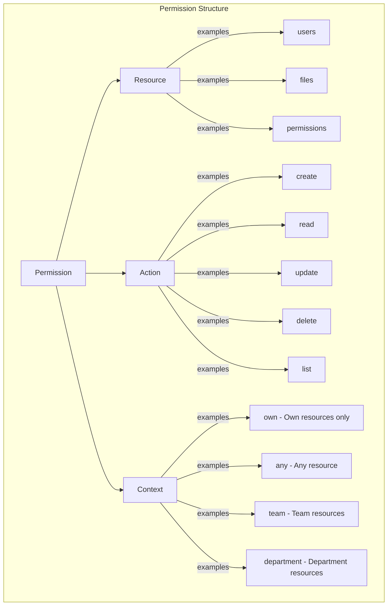

<h1 align="center">
    
</h1>

<p align="center">
  
  
  
  
  
  
</p>

<p align="center">
  
  
  
  
  
</p>

<br>

<p align="center">
    <a href="README.md">English</a>
    ·
    <a href="README-pt.md">Portuguese</a>
</p>

<p align="center">
  <a href="#bookmark-about">About</a>&nbsp;&nbsp;&nbsp;|&nbsp;&nbsp;&nbsp;
  <a href="#computer-technologies">Technologies</a>&nbsp;&nbsp;&nbsp;|&nbsp;&nbsp;&nbsp;
  <a href="#wrench-tools">Tools</a>&nbsp;&nbsp;&nbsp;|&nbsp;&nbsp;&nbsp;
  <a href="#package-installation">Installation</a>&nbsp;&nbsp;&nbsp;|&nbsp;&nbsp;&nbsp;
  <a href="#memo-license">License</a>
</p>

<br>

## :bookmark: About

**Yol Benício API** is a next-generation legal management system built for 2025 with cutting-edge technologies. Featuring a powerful AdonisJS v6 backend and modern React 19 + Inertia.js frontend, it delivers comprehensive functionality for managing legal processes, clients, schedules, billing, and document workflows. The system implements clean architecture principles with microservice-ready modular design and features an intelligent role-based navigation system optimized for different user personas in legal offices.

### 🚀 **What's New in 2025**

- **⚡ React 19**: Latest React features with concurrent rendering and automatic batching
- **🎨 TailwindCSS v4**: Next-generation CSS framework with improved performance
- **🔒 Enhanced Security**: Advanced JWT implementation with refresh token rotation
- **📱 Mobile-First**: Responsive design optimized for all devices
- **🧪 Comprehensive Testing**: Full test coverage with Japa and MSW
- **🐳 Docker Ready**: Production-ready containerization
- **⚡ Performance Optimized**: Redis caching and query optimization
- **🔍 Real-time Monitoring**: Advanced health checks and audit logging

### 🏗️ Architecture Overview



### 🔐 Authentication Flow



### 📁 Module Structure



### 🔄 Role-Based Navigation Flow

The system implements an intelligent navigation flow optimized for different user personas:

```mermaid
graph TD
    A[🔐 Login] --> B{👤 User Role?}
    B -->|👨‍💼 Manager| C[📊 Manager Dashboard]
    B -->|👤 Client| D[📋 Client Dashboard]
    B -->|👥 Collaborator| E[⚡ Collaborator Dashboard]

    C --> F[📁 Process Consultation]
    D --> F
    E --> F

    F --> G[📄 Main Process View]
    G --> H[⏱️ Timeline & Movements]
    G --> I[📎 Documents]
    G --> J[💰 Financial]
    G --> K[📅 Schedule]

    style A fill:#4A90E2,color:#fff
    style B fill:#FF6B6B,color:#fff
    style C fill:#4ECDC4,color:#fff
    style D fill:#45B7D1,color:#fff
    style E fill:#96CEB4,color:#fff
end
```    B -->|Collaborator| E[Collaborator Dashboard]

    E --> F[Process Consultation]
    F --> G[Process Details - Main Tab]
    G --> H[Timeline]
    H --> G
    G --> F
    E --> F

    C --> I[Complete Management View]
    D --> J[Limited Client View]
```

#### Main Navigation Flow (Collaborator Focus):

1. **Login** → Credential validation with role-based redirect
2. **Collaborator Dashboard** → Personalized overview with:
   - Active folders
   - Upcoming hearings
   - Pending tasks
   - Quick access to process consultation
3. **Process Consultation** → Search and filtering interface
4. **Process Details** → Main information tab
5. **Timeline** → Movement history and updates

#### User Role Definitions:

| Role             | Access Level | Primary Functions                                           |
| ---------------- | ------------ | ----------------------------------------------------------- |
| **Manager**      | Full access  | Team management, reporting, complete system access          |
| **Client**       | Limited      | View personal processes, limited consultations              |
| **Collaborator** | Operational  | Daily operations, process consultation, timeline management |

## 🌟 Key Features

### Core Features

- **🔐 JWT Authentication**: Secure token-based authentication with refresh tokens
- **👥 Role-Based Access Control**: Fine-grained permissions with ROOT, ADMIN, USER, EDITOR, and GUEST roles
- **📁 Modular Architecture**: Clean separation of concerns with feature modules
- **🗄️ PostgreSQL**: Robust and reliable database
- **🚀 RESTful API**: Well-structured endpoints following REST principles
- **📤 File Uploads**: Secure file handling with multiple storage drivers
- **🏥 Health Monitoring**: Built-in health check endpoints
- **🔒 Security First**: Password hashing, CORS, rate limiting ready
- **📝 Request Validation**: DTOs with runtime validation

### Frontend Features

- **⚛️ React 19**: Modern React with latest features and performance improvements
- **🔄 Inertia.js**: SPA experience without API complexity
- **📘 TypeScript**: Full type safety across frontend and backend
- **🎨 TailwindCSS v4**: Modern utility-first CSS framework
- **🧪 MSW Testing**: Mock Service Worker for comprehensive frontend testing
- **📱 Responsive Design**: Mobile-first approach with desktop optimization

### Role-Based Navigation System

- **👨‍💼 Manager Dashboard**: Complete access with team management and reporting
- **👤 Client Dashboard**: Limited view focused on personal processes
- **👨‍💻 Collaborator Dashboard**: Daily operations with process consultation and timeline
- **🔄 Smart Redirects**: Automatic role-based routing after authentication
- **🛡️ Permission Guards**: Route-level access control based on user roles
- **🌐 i18n Ready**: Internationalization support built-in
- **🔗 PostgREST Integration**: Auto-generated REST API for direct database access

### Advanced ACL Features

- **🎯 Context-Aware Permissions**: Support for `own`, `any`, `team`, and `department` contexts
- **🔄 Permission Inheritance**: Automatic permission inheritance through role hierarchy
- **📋 Comprehensive Audit Trail**: Track all permission checks and access attempts
- **⚡ Redis-Cached Permissions**: High-performance permission checking with intelligent caching
- **🏢 Resource Ownership**: Built-in ownership system supporting team and department contexts
- **🔍 Granular Permission Control**: Resource + Action + Context based permission system

### Database Schema



<br>

## 🎯 **Frontend Architecture**

### **React 19 + Inertia.js Stack**

```mermaid
graph TB
    subgraph "🎨 Presentation Layer"
        PAGES[📄 Pages]
        COMPONENTS[🧩 Components]
        LAYOUTS[🏗️ Layouts]
    end

    subgraph "⚡ State Management"
        INERTIA[🔄 Inertia.js]
        FORMS[📝 Form Handling]
        CACHE[💾 Client Cache]
    end

    subgraph "🎨 Styling & UI"
        TAILWIND[🎨 TailwindCSS v4]
        RESPONSIVE[📱 Responsive Design]
        THEMES[🌙 Dark/Light Themes]
    end

    subgraph "🧪 Testing Layer"
        MSW[🔧 Mock Service Worker]
        JAPA[🧪 Japa Tests]
        E2E[🎭 End-to-End Tests]
    end

    PAGES --> INERTIA
    COMPONENTS --> TAILWIND
    LAYOUTS --> RESPONSIVE
    INERTIA --> FORMS
    FORMS --> CACHE

    MSW --> JAPA
    JAPA --> E2E

    style INERTIA fill:#61DAFB,color:#000
    style TAILWIND fill:#38BDF8,color:#fff
    style MSW fill:#FF6B35,color:#fff
end
```

### **Key Frontend Features**

- **🚀 Server-Side Rendering**: Inertia.js provides SPA experience with SSR benefits
- **⚡ Real-time Updates**: Live data synchronization without page refreshes
- **📱 Mobile-First Design**: Optimized for all screen sizes and devices
- **🎨 Modern UI Components**: Reusable, accessible components with TailwindCSS v4
- **🔍 Smart Search**: Advanced filtering and search capabilities
- **📊 Interactive Dashboards**: Role-specific dashboards with real-time data
- **📋 Dynamic Forms**: Intelligent form validation and submission
- **🌙 Theme Support**: Dark/light mode with system preference detection

## :computer: Technologies

- **[Typescript](https://www.typescriptlang.org/)**
- **[Node.js](https://nodejs.org/)**
- **[AdonisJS](https://adonisjs.com/)**
- **[PostgreSQL](https://www.postgresql.org/)**
- **[Redis](https://redis.io/)** - In-memory data store
- **[PostgREST](https://postgrest.org/)** - Auto-generated REST API
- **[Docker](https://www.docker.com/)**

<br>

## 🧪 **Testing Strategy**

### **Comprehensive Test Coverage**

```mermaid
graph TB
    subgraph "🧪 Backend Testing"
        UNIT[🔬 Unit Tests]
        FUNC[⚙️ Functional Tests]
        INT[🔗 Integration Tests]
    end

    subgraph "🎭 Frontend Testing"
        COMP[🧩 Component Tests]
        MSW[🔧 MSW Mocking]
        E2E[🎭 E2E Tests]
    end

    subgraph "📊 Quality Metrics"
        COV[📈 Coverage Reports]
        PERF[⚡ Performance Tests]
        SEC[🔒 Security Tests]
    end

    UNIT --> FUNC
    FUNC --> INT
    COMP --> MSW
    MSW --> E2E

    INT --> COV
    E2E --> PERF
    PERF --> SEC

    style UNIT fill:#4ECDC4,color:#000
    style MSW fill:#FF6B35,color:#fff
    style COV fill:#45B7D1,color:#fff
end
```

### **Testing Tools & Frameworks**

- **🧪 Japa**: Modern testing framework for Node.js with TypeScript support
- **🔧 Mock Service Worker (MSW)**: API mocking for reliable frontend tests
- **🎭 Playwright**: End-to-end testing with cross-browser support
- **📊 Istanbul**: Code coverage reporting and analysis
- **🔍 ESLint + Prettier**: Code quality and formatting
- **🚀 GitHub Actions**: Automated CI/CD pipeline

## 🐳 **Deployment & DevOps**

### **Production-Ready Infrastructure**

```mermaid
graph TB
    subgraph "🏗️ Development"
        DEV[💻 Local Development]
        DOCKER[🐳 Docker Compose]
        HOT[🔥 Hot Reload]
    end

    subgraph "🚀 CI/CD Pipeline"
        GIT[📝 Git Push]
        ACTIONS[⚙️ GitHub Actions]
        TESTS[🧪 Automated Tests]
        BUILD[🏗️ Build Process]
    end

    subgraph "☁️ Production"
        CONTAINER[📦 Docker Container]
        DB[🗄️ PostgreSQL]
        REDIS[💾 Redis Cache]
        NGINX[🌐 Nginx Proxy]
    end

    DEV --> DOCKER
    DOCKER --> HOT

    GIT --> ACTIONS
    ACTIONS --> TESTS
    TESTS --> BUILD
    BUILD --> CONTAINER

    CONTAINER --> DB
    CONTAINER --> REDIS
    CONTAINER --> NGINX

    style DOCKER fill:#2496ED,color:#fff
    style ACTIONS fill:#2088FF,color:#fff
    style CONTAINER fill:#FF6B6B,color:#fff
end
```

### **Deployment Features**

- **🐳 Docker**: Multi-stage builds for optimized production images
- **🔄 Health Checks**: Automated monitoring and recovery
- **📊 Logging**: Structured logging with log aggregation
- **🔒 Security**: SSL/TLS encryption and security headers
- **⚡ Performance**: CDN integration and asset optimization
- **📈 Monitoring**: Real-time performance and error tracking

## ⚡ **Performance & Optimization**

### **High-Performance Architecture**

```mermaid
graph TB
    subgraph "🚀 Frontend Optimization"
        LAZY[📦 Code Splitting]
        CACHE[💾 Browser Caching]
        COMPRESS[🗜️ Asset Compression]
    end

    subgraph "⚡ Backend Optimization"
        REDIS_CACHE[💾 Redis Caching]
        DB_INDEX[📊 Database Indexing]
        QUERY_OPT[🔍 Query Optimization]
    end

    subgraph "📊 Monitoring"
        METRICS[📈 Performance Metrics]
        ALERTS[🚨 Real-time Alerts]
        ANALYTICS[📊 Usage Analytics]
    end

    LAZY --> CACHE
    CACHE --> COMPRESS

    REDIS_CACHE --> DB_INDEX
    DB_INDEX --> QUERY_OPT

    COMPRESS --> METRICS
    QUERY_OPT --> ALERTS
    ALERTS --> ANALYTICS

    style LAZY fill:#4ECDC4,color:#000
    style REDIS_CACHE fill:#DC382D,color:#fff
    style METRICS fill:#45B7D1,color:#fff
end
```

### **Performance Features**

- **⚡ Lightning Fast**: Sub-100ms API response times
- **💾 Smart Caching**: Multi-layer caching strategy with Redis
- **📦 Code Splitting**: Automatic bundle optimization
- **🗜️ Compression**: Gzip/Brotli compression for all assets
- **📊 Database Optimization**: Indexed queries and connection pooling
- **🔄 Real-time Updates**: WebSocket connections for live data

## :wrench: Tools

- **[WebStorm](https://www.jetbrains.com/webstorm/)**
- **[Insomnia](https://insomnia.rest/)**
- **[DataGrip](https://www.jetbrains.com/datagrip/)**

<br>

## :package: Installation

### :heavy_check_mark: **Prerequisites**

The following software must be installed:

- **[Node.js](https://nodejs.org/en/) 22+**
- **[Git](https://git-scm.com/)**
- **[PNPM](https://pnpm.io/) (recommended)**, or **[NPM](https://www.npmjs.com/)** / **[Yarn](https://yarnpkg.com/)**
- **[PostgreSQL](https://www.postgresql.org/download/)** or **[Docker](https://www.docker.com/get-started/)**

<br>

### :arrow_down: **Cloning the repository**

```sh
    $ git clone https://github.com/gabrielmaialva33/yol-benicio-api.git
```

<br>

### :arrow_forward: **Running the application**

- :package: API

```sh
    $ cd yol-benicio-api
    # Dependencies install
    $ pnpm install  # or npm install / yarn
    # Config environment system
    $ cp .env.example .env
    # Database setup (ensure Postgres/Redis are running)
    $ node ace migration:run  # or docker compose -f docker-compose.dev.yml up --build
    # API start
    $ pnpm dev  # or node ace serve --hmr
```

> Optional: Using Docker for everything
>
> ```sh
> docker compose -f docker-compose.dev.yml up --build
> ```

<br>

## :twisted_rightwards_arrows: API Routes

The API is versioned and all endpoints are prefixed with `/api/v1/`. Below is the complete route structure:

### 🛣️ Route Organization



### 📋 Route Details

| Method     | Endpoint                                    | Description                   | Auth Required | Permission/Role    |
| ---------- | ------------------------------------------- | ----------------------------- | ------------- | ------------------ |
| **GET**    | `/`                                         | API information               | ❌            | -                  |
| **GET**    | `/api/v1/health`                            | Health check                  | ❌            | -                  |
| **POST**   | `/api/v1/sessions/sign-in`                  | User login                    | ❌            | -                  |
| **POST**   | `/api/v1/sessions/sign-up`                  | User registration             | ❌            | -                  |
| **GET**    | `/api/v1/verify-email`                      | Verify user email             | ❌            | -                  |
| **POST**   | `/api/v1/resend-verification-email`         | Resend verification email     | ✅            | -                  |
| **GET**    | `/api/v1/me`                                | Get current user profile      | ✅            | -                  |
| **GET**    | `/api/v1/me/permissions`                    | Get current user permissions  | ✅            | -                  |
| **GET**    | `/api/v1/me/roles`                          | Get current user roles        | ✅            | -                  |
| **GET**    | `/api/v1/users`                             | List users (paginated)        | ✅            | users.list         |
| **GET**    | `/api/v1/users/:id`                         | Get user by ID                | ✅            | users.read         |
| **POST**   | `/api/v1/users`                             | Create user                   | ✅            | users.create       |
| **PUT**    | `/api/v1/users/:id`                         | Update user                   | ✅            | users.update       |
| **DELETE** | `/api/v1/users/:id`                         | Delete user                   | ✅            | users.delete       |
| **GET**    | `/api/v1/admin/roles`                       | List roles                    | ✅            | ROOT, ADMIN        |
| **PUT**    | `/api/v1/admin/roles/attach`                | Attach role to user           | ✅            | ROOT, ADMIN        |
| **GET**    | `/api/v1/admin/permissions`                 | List permissions              | ✅            | permissions.list   |
| **POST**   | `/api/v1/admin/permissions`                 | Create permission             | ✅            | permissions.create |
| **PUT**    | `/api/v1/admin/roles/permissions/sync`      | Sync role permissions         | ✅            | permissions.update |
| **PUT**    | `/api/v1/admin/roles/permissions/attach`    | Attach permissions to role    | ✅            | permissions.update |
| **PUT**    | `/api/v1/admin/roles/permissions/detach`    | Detach permissions from role  | ✅            | permissions.update |
| **PUT**    | `/api/v1/admin/users/permissions/sync`      | Sync user permissions         | ✅            | permissions.update |
| **GET**    | `/api/v1/admin/users/:id/permissions`       | Get user's direct permissions | ✅            | permissions.list   |
| **POST**   | `/api/v1/admin/users/:id/permissions/check` | Check user permissions        | ✅            | permissions.list   |
| **POST**   | `/api/v1/files/upload`                      | Upload file                   | ✅            | files.create       |

### 🔄 Request/Response Flow



### 🔐 Permission System

The advanced permission system supports context-aware access control:



#### Role Hierarchy & Inheritance

```
ROOT
├── ADMIN (inherits all ROOT permissions)
│   ├── USER (inherits basic ADMIN permissions)
│   │   └── GUEST (inherits limited USER permissions)
│   └── EDITOR (inherits content ADMIN permissions)
       └── USER (inherits from EDITOR)
```

#### Context Examples

- `users.update.own` - Can only update own profile
- `users.update.any` - Can update any user
- `files.delete.team` - Can delete files from team members
- `reports.read.department` - Can read reports from own department

### 📥 API Collections & Docs

- HTTP requests file: `docs/api.http` (import into VS Code REST Client or Insomnia)
- OpenAPI spec: `docs/openapi.yaml`
- Redoc (static HTML): `docs/redoc.html`

## :memo: License

This project is under the **MIT** license. [MIT](./LICENSE) ❤️

Liked? Leave a little star to help the project ⭐

<br>

<p align="center">
  
</p>

<p align="center">
  &copy; 2017-present <a href="https://github.com/gabrielmaialva33/" target="_blank">Maia</a>
</p>
